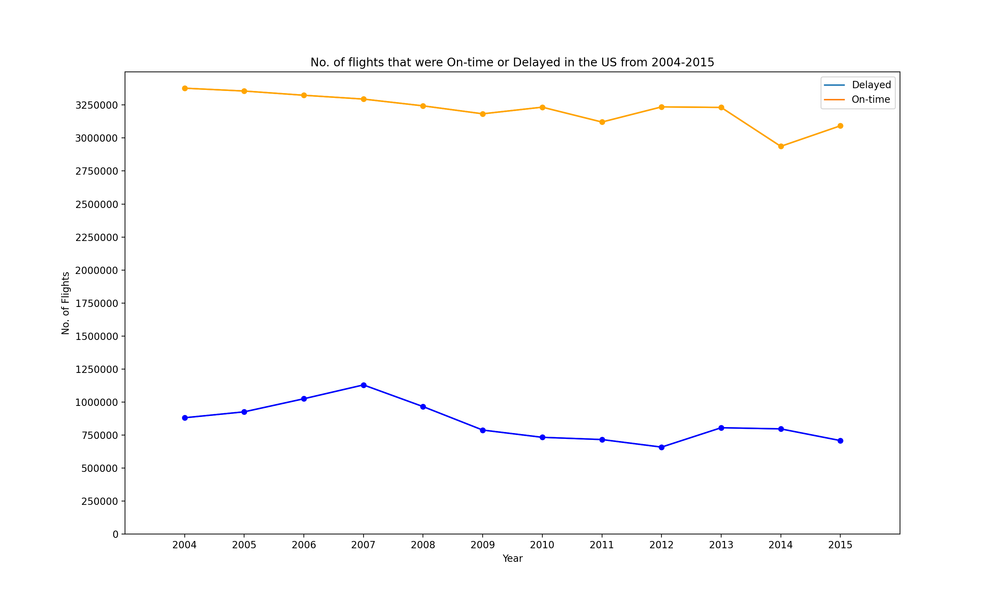
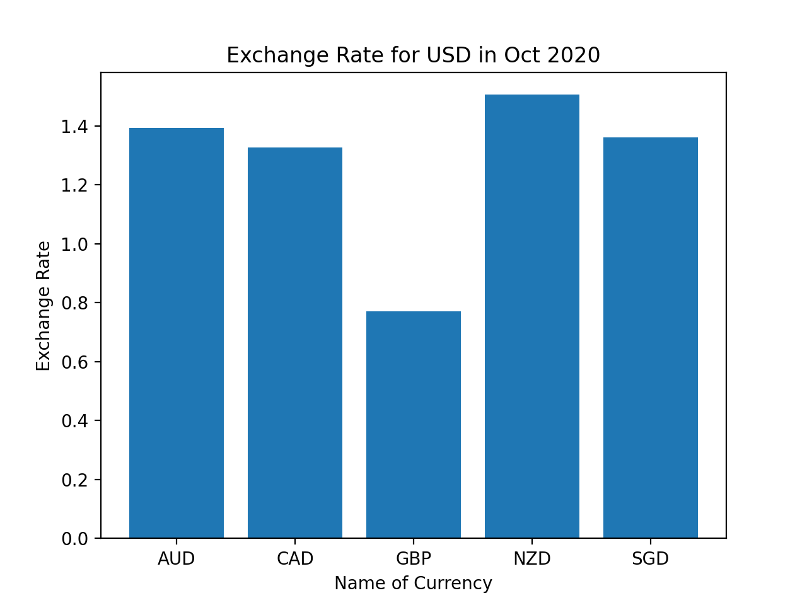

# Homework 2: Visualizing interesting datasets

## Graph 1: No. of flights that were On-time or Delayed in the US from 2004-2015

This graph shows the total the number of flights that were on-time or elayed in the US betwwen 2004 and 2015. From this graph, we can easily tell that most flights were on-time with an average difference of 200,000 flights between those that were on-time and those that were delayed. The data used to create this plot included all major airports across the US such as Logan International, Washington Dulles International, and John F. Kennedy International.[You can find the orignal data here!](https://github.com/jdorfman/awesome-json-datasets) 

## Graph 2: Exchange Rate for USD in Oct 2020

This bar graph shows the exchange rate for USD for some popular currencies. The x axis provides the name of the currency and the y axis indicates the value of the exchange rate for $1 USD. For example, 1 USD would be equal to 1.4 AUD. The data used to create this plot included all major currencies of the world, but I chose to depcit currencies that I have used and am familiar with.[You can find the original data here!](https://github.com/jdorfman/awesome-json-datasets) 

[Here's a link to the the instructions for this project](https://github.com/mikeizbicki/cmc-csci040/tree/2020fall/hw_02)

